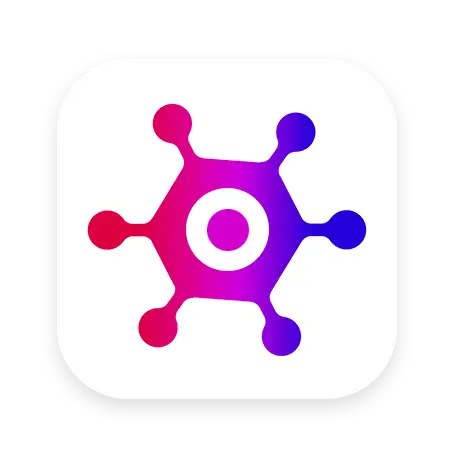

# 🎮 GameVerse

**Discover and explore amazing games from around the world**

GameVerse is a modern, responsive web application that lets you search, filter, and discover your next favorite game. Built with React, TypeScript, and Chakra UI, it provides a seamless gaming discovery experience powered by the RAWG Video Games Database.



## ✨ Features

- 🔍 **Smart Search** - Find games by title with real-time search
- 🎯 **Advanced Filtering** - Filter by genre, platform, and more
- 📊 **Sort Options** - Sort by popularity, rating, release date, and other criteria
- 🌓 **Dark/Light Mode** - Toggle between themes for comfortable viewing
- 📱 **Responsive Design** - Optimized for desktop, tablet, and mobile devices
- ⚡ **Infinite Scrolling** - Seamless game browsing with automatic loading
- 🎨 **Modern UI** - Clean, intuitive interface built with Chakra UI
- 📈 **Game Ratings** - View critic scores and game ratings
- 🏷️ **Platform Icons** - Visual platform indicators for each game

## 🚀 Tech Stack

- **Frontend Framework**: React 18 with TypeScript
- **UI Library**: Chakra UI v2.8.0
- **State Management**: TanStack React Query (React Query v5)
- **HTTP Client**: Axios
- **Build Tool**: Vite
- **Styling**: Emotion (CSS-in-JS)
- **Icons**: React Icons
- **Theme Management**: Next Themes
- **Animations**: Framer Motion

## 🛠️ Installation & Setup

### Prerequisites

- Node.js (v16 or higher)
- npm or yarn package manager

### Clone the Repository

```bash
git clone https://github.com/OmKumar07/GameVerse.git
cd GameVerse
```

### Install Dependencies

```bash
npm install
```

### Environment Setup

1. Get your API key from [RAWG Video Games Database](https://rawg.io/apidocs)
2. Create a `.env` file in the root directory:

```env
VITE_RAWG_API_KEY=your_api_key_here
```

### Run Development Server

```bash
npm run dev
```

The application will be available at `http://localhost:5173`

## 📦 Build & Deployment

### Production Build

```bash
npm run build
```

### Preview Production Build

```bash
npm run preview
```

### Deploy to Netlify

1. Build the project: `npm run build`
2. Upload the `dist` folder to Netlify
3. Set the build command to `npm run build`
4. Set the publish directory to `dist`

## 🎯 API Integration

GameVerse integrates with the RAWG Video Games Database API to provide:

- **Game Search**: Real-time game search functionality
- **Game Details**: Comprehensive game information including ratings, platforms, and descriptions
- **Genre Filtering**: Browse games by specific genres
- **Platform Filtering**: Filter games by gaming platforms
- **Sorting Options**: Multiple sorting criteria for game discovery

## 🎨 UI Components

The application features a modular component architecture:

- **GameGrid**: Main grid layout for displaying games
- **GameCard**: Individual game display cards with images and details
- **SearchInput**: Real-time search functionality
- **GenreList**: Genre filtering sidebar
- **PlatformSelector**: Platform filtering dropdown
- **SortSelector**: Sorting options dropdown
- **NavBar**: Navigation header with logo and search
- **ColorModeSwitch**: Dark/light mode toggle

## 🔧 Key Features Implementation

### Infinite Scrolling

Implemented using TanStack React Query's `useInfiniteQuery` for seamless pagination and optimal performance.

### Error Handling

Comprehensive error handling with user-friendly error messages and retry mechanisms.

### Theme Support

Full dark/light mode support with system preference detection and manual toggle.

### Responsive Design

Mobile-first responsive design ensuring optimal experience across all device sizes.

## 📁 Project Structure

```
GameVerse/
├── public/                 # Static assets
│   ├── favicon.ico        # Favicon files
│   ├── favicon-32x32.png
│   └── logo.webp          # Logo and favicon
├── src/
│   ├── components/        # React components
│   │   ├── ui/           # UI components
│   │   ├── GameCard.tsx
│   │   ├── GameGrid.tsx
│   │   ├── NavBar.tsx
│   │   └── ...
│   ├── entities/         # TypeScript interfaces
│   ├── hooks/           # Custom React hooks
│   ├── services/        # API client configuration
│   ├── theme/          # Theme configuration
│   ├── App.tsx         # Main application component
│   └── main.tsx        # Application entry point
├── index.html          # HTML template
├── package.json       # Dependencies and scripts
├── tsconfig.json      # TypeScript configuration
├── vite.config.ts     # Vite configuration
└── README.md          # Project documentation
```

## 🤝 Contributing

1. Fork the repository
2. Create a feature branch: `git checkout -b feature/new-feature`
3. Commit your changes: `git commit -m 'Add new feature'`
4. Push to the branch: `git push origin feature/new-feature`
5. Submit a pull request

## 📄 License

This project is licensed under the MIT License - see the [LICENSE](LICENSE) file for details.

## 🙏 Acknowledgments

- [RAWG Video Games Database](https://rawg.io/) for providing the comprehensive games API
- [Chakra UI](https://chakra-ui.com/) for the beautiful component library
- [React Icons](https://react-icons.github.io/react-icons/) for the icon set
- [Vite](https://vitejs.dev/) for the fast build tool

## 📞 Contact

- **Developer**: Om Kumar
- **Repository**: [GitHub - GameVerse](https://github.com/OmKumar07/GameVerse)
- **Live Demo**: [GameVerse Live]([https://your-demo-url.netlify.app](https://game-verse7.netlify.app/))

---

Made with ❤️ and ☕ by Om Kumar
